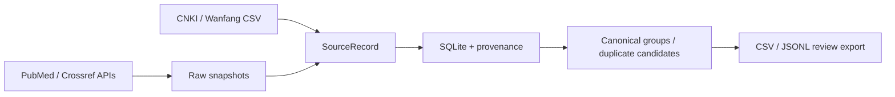

# GuidelineOps-CN

GuidelineOps-CN is a reproducible, provenance-first metadata pipeline for
discovering Chinese clinical guidelines, expert consensuses, and related
normative documents. It is designed for research and education, not for
diagnosis, treatment, prescribing, or clinical decision support.

## What works in v0.1

- PubMed E-utilities: ESearch, EFetch, XML parsing, rate limiting, retries, and raw snapshots.
- Crossref REST API: title search, DOI lookup, publication/license metadata.
- CNKI and Wanfang: offline import of user-exported CSV metadata only.
- Pydantic records, SQLite persistence, conservative DOI/PMID deduplication, and review-only title candidates.
- UTF-8 CSV/JSONL exports and a PubMed-first `discover` command.



## Install

Python 3.11+ and [uv](https://docs.astral.sh/uv/) are required:

```bash
uv sync
uv run pytest
uv run guidelineops --help
```

For PubMed, configure a contact email as required by NCBI:

```bash
NCBI_EMAIL=researcher@example.org uv run guidelineops pubmed-search "COPD guideline" --limit 10 --since 2015
```

Other commands:

```bash
uv run guidelineops crossref-search "COPD guideline" --limit 10
uv run guidelineops crossref-enrich 10.1000/example
uv run guidelineops import-file --source cnki exports/cnki.csv
uv run guidelineops import-file --source wanfang exports/wanfang.csv
uv run guidelineops discover --disease "COPD guideline" --since 2015 --limit 20
uv run guidelineops quality-report
```

`discover` writes `data/guideline_candidates.csv`,
`data/guideline_candidates.jsonl`, and a SQLite database. Raw API responses are
stored under `data/raw/` with SHA-256 provenance and are ignored by Git.

`quality-report` reads the configured SQLite database and writes metadata quality
signals to `data/quality_report.json` and `data/quality_report.md` (or the
configured `DATA_DIR`). The report is for research and education only: it does
not provide clinical recommendations and never automatically approves or
rejects records.

## Source and copyright boundary

The project stores metadata and links, not paywalled CNKI/Wanfang full text.
It never bypasses authentication or CAPTCHA and never invents undocumented API
endpoints. Check the license and terms of every source before redistribution.
All outputs are candidate records requiring human medical review.

## Development

```bash
uv run ruff check .
uv run pytest
```

The repository is for research and educational use only. It is not a medical
device and must not be used to make or support real-world clinical decisions.
