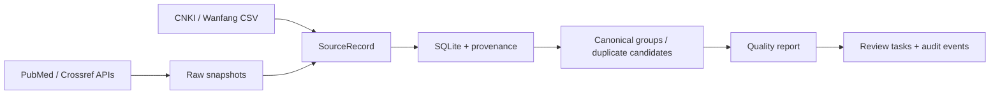

# GuidelineOps-CN

[English](README.md) | [简体中文](README.zh-CN.md)

[](actions/workflows/ci.yml)

**A provenance-first metadata and knowledge-governance pipeline for Chinese clinical guidelines, expert consensuses, and related normative documents.**

**面向中国临床指南、专家共识及相关规范性文献的来源可追溯元数据与知识治理管道。** 项目保存来源快照、规范化元数据、保守识别重复候选，并通过人工审核任务和不可变审计事件管理知识生命周期；它不生成诊断、治疗、处方或患者个体化临床建议。完整中文介绍见 [`README.zh-CN.md`](README.zh-CN.md)。

> [!IMPORTANT]
> GuidelineOps-CN is research and education software. It does not provide diagnosis, treatment, prescribing, or patient-specific clinical decision support.

GuidelineOps-CN v0.3.0 makes evidence discovery and review reproducible: source snapshots, normalized records, conservative duplicate candidates, metadata quality signals, human review tasks, immutable audit events, and controlled knowledge-unit lifecycle actions.

## What works in v0.3.0

- PubMed E-utilities and Crossref metadata retrieval with retries and raw snapshots.
- Offline import of user-exported CNKI and Wanfang CSV metadata; no paywall or CAPTCHA bypass.
- Pydantic validation, SQLite persistence, DOI/PMID deduplication, and review-only title candidates.
- Deterministic quality reports and auditable, role-routed review tasks.
- Source-grounded knowledge units, two-stage review for high-risk content, retraction impact analysis, and protected snapshots.

## Quick start

Python 3.11+ and [uv](https://docs.astral.sh/uv/) are required:

```bash
uv sync
uv run pytest
uv run guidelineops --help
```

## Feedback wanted

Medical-informatics, evidence-based medicine, guideline-development, information-science, and healthcare-AI reviewers are invited to comment on:

1. Which metadata quality risks or provenance fields are missing?
2. Are the reviewer roles, escalation paths, and knowledge lifecycle realistic?
3. Which legally accessible metadata sources or synthetic examples should be supported next?

Use [GitHub Discussions](https://github.com/zhhtong/guidelineops-cn/discussions) for open-ended feedback and [Issues](https://github.com/zhhtong/guidelineops-cn/issues/new/choose) for reproducible defects or scoped proposals. Never submit paywalled full text, patient data, credentials, or confidential institutional material.

**Related project:** [AmendBench](https://github.com/zhhtong/AmendBench) explores traceable, human-controlled impact assessment for clinical-trial protocol amendments. The projects are complementary; they are not currently integrated.



## Search and workflow commands

For PubMed, configure a contact email as required by NCBI:

```bash
NCBI_EMAIL=researcher@example.org uv run guidelineops pubmed-search "COPD guideline" --limit 10 --since 2015
```

Other commands:

```bash
uv run guidelineops crossref-search "COPD guideline" --limit 10
uv run guidelineops crossref-enrich 10.1000/example
uv run guidelineops import-file --source cnki exports/cnki.csv
uv run guidelineops import-file --source wanfang exports/wanfang.csv
uv run guidelineops discover --disease "COPD guideline" --since 2015 --limit 20
uv run guidelineops quality-report
uv run guidelineops database-status
uv run guidelineops database-backup backups/
DATABASE_URL="sqlite:///./data/recovery-copy.db" uv run guidelineops database-restore backups/guidelineops-backup-YYYYMMDDTHHMMSSZ.db
uv run guidelineops knowledge-validate knowledge.json
uv run guidelineops knowledge-import knowledge.json
uv run guidelineops knowledge-list
uv run guidelineops knowledge-submit ku-copd-001
uv run guidelineops knowledge-impact ku-copd-001
uv run guidelineops knowledge-retract ku-copd-001 --reviewer "Dr Wang" --role medical_lead --reason "Source withdrawn"
uv run guidelineops knowledge-freeze ku-copd-001 --reviewer "Dr Wang" --role medical_lead
uv run guidelineops medication-safety-import medication-safety.json
uv run guidelineops medication-safety-submit med-safety-001
uv run guidelineops medication-safety-list
uv run guidelineops review-sync
uv run guidelineops review-list --status open
uv run guidelineops review-events 12
uv run guidelineops review-claim 12 --reviewer "Dr Li" --role data_curator
uv run guidelineops review-reject 12 --reviewer "Dr Li" --role data_curator --reason "Not a formal guideline"
```

`discover` writes `data/guideline_candidates.csv`,
`data/guideline_candidates.jsonl`, and a SQLite database. Raw API responses are
stored under `data/raw/` with SHA-256 provenance and are ignored by Git.

`quality-report` reads the configured SQLite database and writes metadata quality
signals to `data/quality_report.json` and `data/quality_report.md` (or the
configured `DATA_DIR`). The report is for research and education only: it does
not provide clinical recommendations and never automatically approves or
rejects records.

`database-status` reports the managed SQLite schema version. `database-backup`
creates a SQLite online-backup artifact and a JSON manifest containing its
SHA-256, byte count and schema version. Restore into a new `DATABASE_URL` by
default; replacing an existing database requires `database-restore --force`.
Always store artifacts outside the repository and run a restore drill before
relying on a backup. Backup files can contain operational metadata and audit
records, so they must not be committed to public Git repositories.

`knowledge-validate` validates a JSON object or array of source-grounded knowledge
units, including source location, evidence grade, review status, and TCM/Western
mapping fields. It performs no clinical inference or recommendation.

`knowledge-import` validates and idempotently stores those units in SQLite;
`knowledge-list` prints the persisted units as JSON Lines for review or export;
`knowledge-submit` moves one unit to `pending`, and `review-sync` creates its
medical-review task. High-risk knowledge uses two named reviewers: a
`medical_reviewer` completes primary review, then an independent `medical_lead`
must complete final review before the unit becomes `approved`. A rejection is
reflected on the unit immediately unless it is a final-review disagreement. In
that case the unit remains `pending` and an open `knowledge_escalation` task is
created for a `medical_chair`; the escalation preserves both the rejection
reason and reviewer identity instead of silently treating the last decision as
clinical truth.

`knowledge-impact` finds mapping-dependent units before a safety action.
`knowledge-retract` requires a named `medical_lead`, records an immutable reason,
marks the unit `retracted`, and reports the dependent units needing review.
`knowledge-freeze` requires the same role and creates an immutable, SHA-256
protected snapshot only after the unit has completed final approval.

Medication safety statements are stored separately from general knowledge units.
They must cite an existing source unit and are limited to contraindications,
interactions, special populations, organ impairment, monitoring, or withdrawal.
The project rejects dosage and patient-specific prescribing instructions; submitted
rules follow independent `medical_reviewer` and `medical_lead` review.
If the final reviewer disagrees, the rule remains `pending` and a
`medication_safety_escalation` task is routed to `medical_chair`.

`review-sync` turns quality risks and non-destructive duplicate candidates into
idempotent SQLite tasks. Review actions are append-only audit events; they never
alter source metadata, automatically merge records, or make clinical decisions.
Tasks carry a deterministic risk level, required reviewer role, and medical-review
flag. CLI actions must declare `--role`; the queue rejects a role that does not
match the task and records the declared role in the audit trail. A declared role
is workflow routing, not credential or licensure verification.

Deployments can set `REVIEWER_REGISTRY_PATH` to a local JSON allow-list (start
from [`reviewers.example.json`](reviewers.example.json)). When configured, the
CLI permits review actions only when the declared reviewer ID has the declared
role. Keep the registry free of passwords and unnecessary personal information;
it is operational authorization, not identity or professional credential proof.

## Source and copyright boundary

The project stores metadata and links, not paywalled CNKI/Wanfang full text.
It never bypasses authentication or CAPTCHA and never invents undocumented API
endpoints. Check the license and terms of every source before redistribution.
All outputs are candidate records requiring human medical review.

See the [release-readiness checklist](docs/release-readiness.md) before sharing
the system with other users or describing it as production-ready.
The [AI-readiness roadmap](docs/ai-readiness-roadmap.md) explains which
knowledge-governance capabilities are implemented and which model/CDSS claims
are intentionally out of scope.
For a resume-ready project description, see
[`docs/resume-project-profile.md`](docs/resume-project-profile.md).
An offline end-to-end walkthrough with synthetic data is available in
[`examples/demo/README.md`](examples/demo/README.md).

## Development

```bash
uv run ruff check .
uv run pytest
```

The repository is for research and educational use only. It is not a medical
device and must not be used to make or support real-world clinical decisions.
