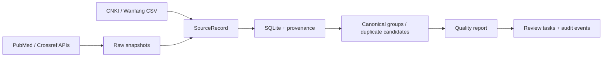

# GuidelineOps-CN

[](actions/workflows/ci.yml)

GuidelineOps-CN v0.3.0 is a reproducible, provenance-first metadata pipeline for
discovering Chinese clinical guidelines, expert consensuses, and related
normative documents. It is designed for research and education, not for
diagnosis, treatment, prescribing, or clinical decision support.

## What works in v0.3

- PubMed E-utilities: ESearch, EFetch, XML parsing, rate limiting, retries, and raw snapshots.
- Crossref REST API: title search, DOI lookup, publication/license metadata.
- CNKI and Wanfang: offline import of user-exported CSV metadata only.
- Pydantic records, SQLite persistence, conservative DOI/PMID deduplication, and review-only title candidates.
- UTF-8 CSV/JSONL exports and a PubMed-first `discover` command.
- Deterministic metadata quality reports plus an auditable human review queue.



## Install

Python 3.11+ and [uv](https://docs.astral.sh/uv/) are required:

```bash
uv sync
uv run pytest
uv run guidelineops --help
```

For PubMed, configure a contact email as required by NCBI:

```bash
NCBI_EMAIL=researcher@example.org uv run guidelineops pubmed-search "COPD guideline" --limit 10 --since 2015
```

Other commands:

```bash
uv run guidelineops crossref-search "COPD guideline" --limit 10
uv run guidelineops crossref-enrich 10.1000/example
uv run guidelineops import-file --source cnki exports/cnki.csv
uv run guidelineops import-file --source wanfang exports/wanfang.csv
uv run guidelineops discover --disease "COPD guideline" --since 2015 --limit 20
uv run guidelineops quality-report
uv run guidelineops review-sync
uv run guidelineops review-list --status open
uv run guidelineops review-events 12
uv run guidelineops review-claim 12 --reviewer "Dr Li" --role data_curator
uv run guidelineops review-reject 12 --reviewer "Dr Li" --role data_curator --reason "Not a formal guideline"
```

`discover` writes `data/guideline_candidates.csv`,
`data/guideline_candidates.jsonl`, and a SQLite database. Raw API responses are
stored under `data/raw/` with SHA-256 provenance and are ignored by Git.

`quality-report` reads the configured SQLite database and writes metadata quality
signals to `data/quality_report.json` and `data/quality_report.md` (or the
configured `DATA_DIR`). The report is for research and education only: it does
not provide clinical recommendations and never automatically approves or
rejects records.

`review-sync` turns quality risks and non-destructive duplicate candidates into
idempotent SQLite tasks. Review actions are append-only audit events; they never
alter source metadata, automatically merge records, or make clinical decisions.
Tasks carry a deterministic risk level, required reviewer role, and medical-review
flag. CLI actions must declare `--role`; the queue rejects a role that does not
match the task and records the declared role in the audit trail. A declared role
is workflow routing, not credential or licensure verification.

Deployments can set `REVIEWER_REGISTRY_PATH` to a local JSON allow-list (start
from [`reviewers.example.json`](reviewers.example.json)). When configured, the
CLI permits review actions only when the declared reviewer ID has the declared
role. Keep the registry free of passwords and unnecessary personal information;
it is operational authorization, not identity or professional credential proof.

## Source and copyright boundary

The project stores metadata and links, not paywalled CNKI/Wanfang full text.
It never bypasses authentication or CAPTCHA and never invents undocumented API
endpoints. Check the license and terms of every source before redistribution.
All outputs are candidate records requiring human medical review.

See the [release-readiness checklist](docs/release-readiness.md) before sharing
the system with other users or describing it as production-ready.

## Development

```bash
uv run ruff check .
uv run pytest
```

The repository is for research and educational use only. It is not a medical
device and must not be used to make or support real-world clinical decisions.
