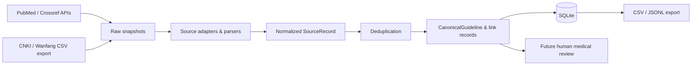

# GuidelineOps-CN V0.1 Design

## Purpose

GuidelineOps-CN is a research and education tool for discovering and governing
metadata about Chinese clinical guidelines, expert consensuses, and related
normative documents. It is not a clinical decision support system and must not
be used for real-world diagnosis or treatment.

The initial release solves one bounded problem: retrieve, preserve, normalize,
deduplicate, and export traceable bibliographic records from approved sources.
It does not download or extract knowledge from protected full texts.

## Scope

V0.1 supports:

- PubMed discovery through NCBI E-utilities (`ESearch` then `EFetch`);
- Crossref title search, DOI lookup, and metadata enrichment;
- offline CSV import from CNKI and Wanfang exports;
- immutable raw-response snapshots, hashes, retrieval timestamps, and parser
  versions;
- SQLite persistence, idempotent upserts, duplicate candidates, and CSV/JSONL
  export;
- a CLI for searching, importing, discovery orchestration, and export.

V0.1 explicitly excludes full-text ingestion, PDF knowledge extraction,
CNKI/Wanfang automated access, browser automation, CAPTCHA/authentication
bypass, RAG, LLMs, embeddings, vector databases, frontend applications, and
clinical decision support.

## Architecture



Every external source implements `SourceAdapter` with `search`, `fetch`, and
`normalize`. Network adapters use explicit timeouts, retry/backoff, rate limits,
a descriptive User-Agent, and structured errors. Adapters never invent an API
endpoint or silently suppress a failure.

## Data Contract and Provenance

`SourceRecord` retains the original source identity and includes at least:
source, source_record_id, title, normalized title, authors, organization,
journal, publication year/date, document type, disease tags, DOI, PMID,
abstract, source URL, access status, language, raw path, raw SHA-256,
retrieval time, review status, and source-specific metadata.

`CanonicalGuideline` represents a deduplicated work. A link table preserves the
many-to-one relationship from source records to a canonical record. Raw files
are written before parsing under `data/raw/<source>/`; the database records the
hash, request URL, retrieval time, and adapter/parser version. This makes a
changed source observable and auditable.

Access is recorded separately from metadata: `open_download`, `open_preview`,
`metadata_only`, `restricted`, or `unknown`, plus a license/status field.
Protected content is neither committed nor automatically downloaded.

## Deduplication Policy

The system merges exact DOI, exact PMID, and identical `(source,
source_record_id)` records. Exact normalized-title matches are high-confidence
candidates. Titles with RapidFuzz similarity >= 95 and publication-year
difference <= 1 are possible duplicates only; they remain visible for human
review and are never silently deleted.

## Commands

The CLI provides:

- `guidelineops pubmed-search QUERY --limit N [--since YEAR]`
- `guidelineops crossref-search QUERY --limit N`
- `guidelineops crossref-enrich`
- `guidelineops import-file --source cnki|wanfang --file PATH`
- `guidelineops discover --disease TEXT --since YEAR --limit N`
- `guidelineops export --format csv|jsonl`

`discover` queries PubMed, persists normalized records, enriches eligible
records from Crossref, performs deduplication, and exports candidate records.
Missing `NCBI_EMAIL` is a clear error for PubMed. Missing Wanfang credentials
only disables the optional future API adapter; CSV import and all other features
continue to work.

## Project Layout and Technology

The repository uses Python 3.11+, uv, httpx, Pydantic v2,
pydantic-settings, SQLAlchemy 2 with SQLite, Typer, tenacity, lxml,
BeautifulSoup4, rapidfuzz, pytest, pytest-asyncio, respx, ruff, and mypy.

Core package modules cover configuration, models, database, normalization,
deduplication, export, provenance, CLI, and `sources/` adapters. Test fixtures
contain sanitized PubMed XML, Crossref JSON, and representative CNKI/Wanfang
CSV files. `.gitignore` excludes `.env`, private material, full text, CAJ files,
and licensed content.

## Reuse Decision

GuidelineOps-CN owns its source-adapter contract, provenance store, normalized
schema, deduplication policy, review workflow, and CLI. Those are the project's
distinctive clinical-governance value and should not be inherited through a
large fork.

It may use the MIT-licensed `habanero` package as an optional low-level Crossref
client, but the adapter remains responsible for snapshots, normalization, and
our retry/error contract. PubMed uses the official E-utilities API via `httpx`;
the archived `biocommons/eutils` package is only a design reference. Existing
TCM knowledge-graph repositories are future terminology/data leads, not V0.1
dependencies, because their scope and upstream dataset licences require
separate review.

## Quality and Acceptance

Default tests are offline and mock HTTP with respx. Optional integration tests
are marked separately. The suite covers schema validation, title/DOI
normalization, PubMed XML parsing, Crossref JSON parsing, valid/invalid CSV
rows, exact and fuzzy deduplication, SQLite idempotent upsert, and exports.

Before release, these commands must succeed:

```powershell
uv sync
uv run ruff check .
uv run pytest
uv run guidelineops --help
```

When network access and a configured NCBI email are available, one real
PubMed/Crossref discovery run must be executed and its generated SQLite, CSV,
and JSONL outputs inspected. If the network is unavailable, the project reports
that fact and demonstrates the full pipeline through fixtures instead.

## Delivery Sequence

1. Scaffold, data models, SQLite, CLI shell, and offline tests.
2. PubMed adapter and verified command.
3. Crossref adapter and enrichment.
4. CNKI/Wanfang CSV importers.
5. Deduplication, exports, and unified discovery command.
6. Only after V0.1 is stable: one source adapter at a time, beginning with
   OpenSTD, using a real sanitized source response as a fixture before writing
   a parser.
