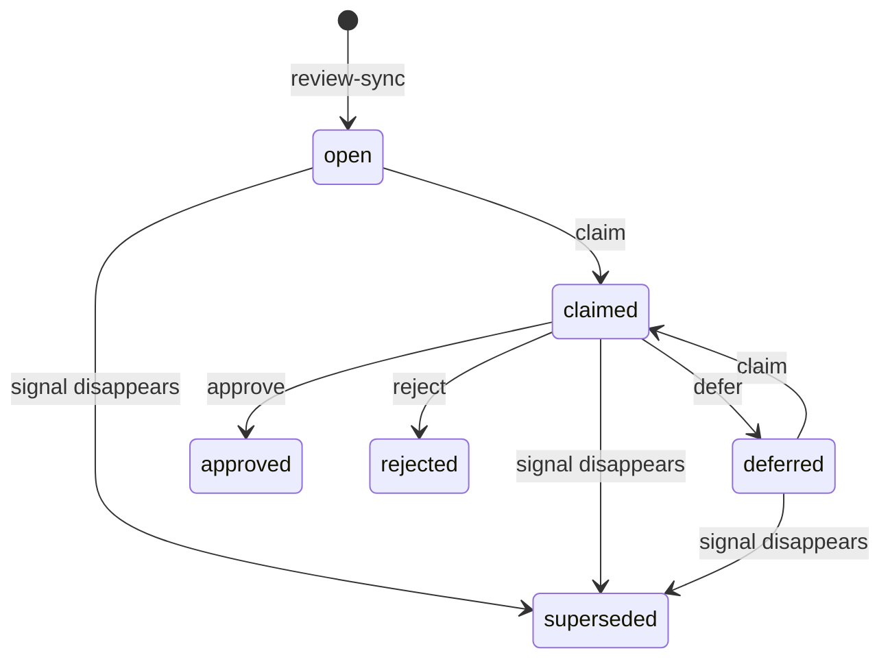
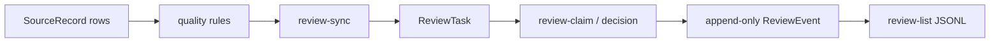

# GuidelineOps-CN v0.3: medical review queue design

## Goal

Turn metadata-quality signals into a persistent, human-operated review queue.
The queue gives a medical reviewer an accountable workflow without changing
source records, clinical guidance, or automatic deduplication decisions.

It is a governance feature for research and education. It does not authenticate
users, authorize clinical action, diagnose, prescribe, or declare a source
clinically valid.

## Scope

v0.3 adds SQLite review tasks, immutable review events, deterministic queue
synchronization, and five CLI actions:

```bash
guidelineops review-sync
guidelineops review-list --status open
guidelineops review-claim 12 --reviewer "张医生"
guidelineops review-approve 12 --reviewer "张医生" --note "已核对原始来源"
guidelineops review-reject 12 --reviewer "张医生" --reason "非正式指南"
guidelineops review-defer 12 --reviewer "张医生" --reason "等待原始文献"
```

The same release also corrects report Markdown mojibake, labels the README as
v0.2/v0.3-capable, and ignores the local `work/` bundle directory.

## Persisted data

### `review_tasks`

Each row represents one reviewable signal. It contains:

- integer `id` primary key;
- unique, stable `fingerprint`;
- `task_type`: `metadata_risk` or `duplicate_candidate`;
- `status`: `open`, `claimed`, `approved`, `rejected`, `deferred`, or
  `superseded`;
- JSON `payload`, preserving the signal details at its most recent sync;
- optional `claimed_by`, `claimed_at`, `resolved_at`;
- UTC `created_at`, `updated_at`, and `last_seen_at` timestamps.

The task payload stores source identity, title, rule reason, and—for a duplicate
candidate—the two source identities, candidate kind, confidence, and score. It
is evidence metadata, never full text or patient data.

### `review_events`

Every workflow operation adds one event; events are append-only. An event stores
the task foreign key, `event_type`, actor string, optional reason/note, UTC
timestamp, and optional JSON payload. The system actor is the literal
`system` for automatic task creation and supersession.

## Deterministic synchronization

`review-sync` reads persisted source records in ascending primary-key order and
uses the existing quality-report rules. It creates tasks from:

- every risk item, with fingerprint
  `risk:<source>:<source_record_id>:<reason>`;
- every duplicate candidate, with the two source identities sorted
  lexicographically and fingerprint
  `duplicate:<kind>:<left_identity>:<right_identity>`.

Repeated syncs update only the task payload, `updated_at`, and `last_seen_at`;
they do not create a duplicate task or duplicate event. A newly discovered
signal creates an `open` task and a `synced` event by `system`.

If an active (`open`, `claimed`, or `deferred`) task's fingerprint is absent
from a later sync, it becomes `superseded` and receives a `superseded` event by
`system`. `approved` and `rejected` tasks are historical conclusions and are
never reopened automatically.

## Human state machine



- `review-claim` accepts only `open` or `deferred` tasks, requires a nonblank
  `--reviewer`, and records `claimed`.
- `review-approve`, `review-reject`, and `review-defer` require a `claimed`
  task whose `claimed_by` equals `--reviewer`.
- `review-reject` and `review-defer` require a nonblank `--reason`.
- `review-approve` accepts an optional `--note`.
- Completed and superseded tasks reject further workflow actions with a concise,
  nonzero CLI error. No command mutates `SourceRecord.review_status`.

## Listing and observability

`review-list` accepts an optional `--status` filter and prints deterministic
JSON Lines, ordered by task ID. Each line contains the task identity, type,
status, claim metadata, timestamps, and payload. It never emits an audit event.

The existing quality report remains a read-only aggregate. Future reports may
summarize task status, but v0.3 does not change the quality-report schema.

## Architecture

`review_queue.py` owns pure task fingerprints, signal conversion, state
transition checks, and the database service functions. `database.py` owns only
SQLAlchemy table mappings and database initialization. `cli.py` parses
commands, opens a session, commits successful actions, and prints concise JSON
or status output.



## Error handling and safety

- Task IDs that do not exist raise a clear nonzero CLI error.
- Invalid status filters and state transitions raise a clear nonzero CLI error.
- Reviewer/reason strings are stripped and empty strings rejected.
- A failed command rolls back its database transaction and adds no event.
- The CLI is an audit identity mechanism, not access control. Production use
  would require authentication, authorization, and concurrent-claim controls.

## Tests and acceptance criteria

Tests must be written before production code and cover:

1. risk and duplicate signals create deterministic, unique tasks;
2. a repeat sync changes no task/event count, and missing active signals become
   superseded once;
3. claim and decision transitions append immutable events;
4. reviewer ownership and required reasons reject invalid actions;
5. CLI sync/list/claim/approve/reject/defer flows using temporary SQLite;
6. no review action changes `SourceRecord.record_data` or its review status;
7. Markdown reports contain no mojibake and the repository ignores `work/`.

Acceptance requires focused tests and the full suite to pass, along with Ruff,
`uv lock --check`, and `git diff --check`. The final commit is synchronized to
X2 and validated with Python bytecode compilation there.
