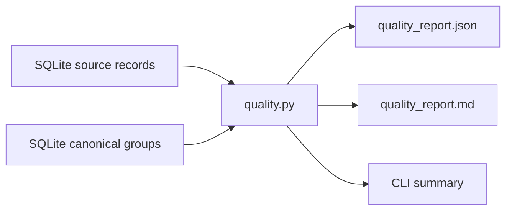

# GuidelineOps-CN v0.2: quality report design

## Goal

Add a deterministic, provenance-preserving quality report for the metadata
records already stored in SQLite. The report is for research and medical-team
review. It must not make clinical recommendations, automatically approve a
record, or change any review status.

## Scope

The v0.2.1 slice adds a `quality-report` CLI command and a small pure-Python
reporting module. It reads `SourceRecordRow.record_data` from the database and
writes two equivalent representations:

- `DATA_DIR/quality_report.json` for product, analytics, and future APIs.
- `DATA_DIR/quality_report.md` for an auditable human review meeting.

The command accepts no source credentials and does not perform network calls.
It uses the configured `DATABASE_URL` and `DATA_DIR`, creating the output
directory as needed. An empty database produces valid zero-value reports and
exits successfully.

## Report contract

The JSON report has this stable top-level shape:

```json
{
  "generated_at": "2026-08-20T00:00:00+00:00",
  "total_records": 0,
  "canonical_records": 0,
  "source_counts": {"pubmed": 0},
  "review_status_counts": {"candidate": 0},
  "field_completeness": {
    "doi": {"present": 0, "missing": 0, "rate": 0.0}
  },
  "risk_items": [],
  "duplicate_candidates": []
}
```

`generated_at` is an aware UTC timestamp. `canonical_records` is the number of
persisted `CanonicalGuidelineRow` rows. Source and review-status mappings are
present only for observed values; a zero-record report uses empty mappings.

The completeness fields are `doi`, `pmid`, `publication_year`, `source_url`,
and `authors`. A value counts as present when it is not `None`, an empty string,
or an empty list. The rate is `present / total_records`, rounded only for
Markdown display; JSON keeps the exact float.

## Risk and duplicate review items

Each `risk_item` contains `source`, `source_record_id`, `title`, and a stable
`reason`. The reasons are deliberately limited to metadata quality checks:

- `missing_publication_year`
- `missing_source_url`
- `missing_identifiers` (both DOI and PMID absent)

Records with a missing title cannot enter the current validated schema and are
therefore not reported as a separate runtime risk.

Duplicate candidates are computed by the existing `group_records` function.
Only its non-destructive candidates are reported. Each item retains the two
source identities, candidate kind, confidence, and optional similarity score.
The report never merges database rows.

## Markdown rendering

The Markdown report contains a generation timestamp, headline counts, source
and review-status tables, a field-completeness table, and numbered risk and
duplicate sections. Empty risk or duplicate sections explicitly state that no
items were found, avoiding ambiguous blank sections.

## CLI and error handling

```bash
uv run guidelineops quality-report
```

On success the command prints the record count and the absolute or configured
paths of both files. Database connection errors are allowed to surface with the
underlying SQLAlchemy message; no partial report file is intentionally written.
Invalid serialized records are treated as a data-integrity error rather than
silently excluded.

## Architecture

`quality.py` owns pure report construction and rendering. The CLI owns database
opening, query orchestration, writing the two files, and concise terminal
output. Existing database models and deduplication code remain unchanged.



## Tests and acceptance criteria

Tests are written before production code and cover:

1. zero-record reports and zero denominators;
2. source, status, and field-completeness counts for mixed records;
3. risk reasons and non-destructive duplicate candidates;
4. UTF-8 JSON and Markdown serialization;
5. the CLI writing both files from a temporary SQLite database.

Acceptance requires the focused test to fail before implementation, then all
existing tests, Ruff, `uv lock --check`, and `git diff --check` to pass.
